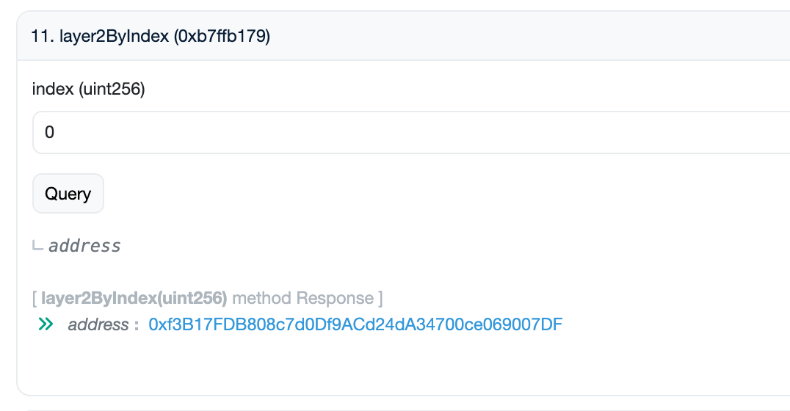
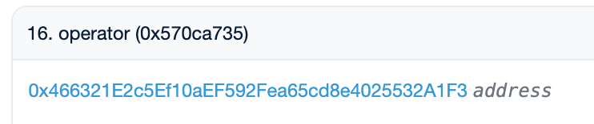
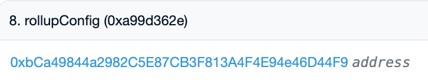

# Operator Information Query Functions
> This document explains the main functions and procedures for checking operator information.
Layer2Registry: [etherscan link](https://etherscan.io/address/0x7846c2248a7b4de77e9c2bae7fbb93bfc286837b)

---

## Table of Contents
- [numLayer2s](#numlayer2s)
- [layer2ByIndex](#layer2byindexuint256-index)
- [memo](#memo)
- [stakedOf](#stakedofaddress-user)
- [totalStaked](#totalstaked)
- [operator](#operator)
- [rollupConfig](#rollupconfig)
- [checkL1BridgeDetail](#checkl1bridgedetailaddress-rollupconfigaddress)
- [optimismPortal](#optimismportal)
- [balanceOf](#operator-balanceofaddress-account)
- [estimatedDistribute](#estimateddistributeuint256-blocknumber-address-opaddress)

---

*********

### [numLayer2s()](https://etherscan.io/address/0x7846c2248a7b4de77e9c2bae7fbb93bfc286837b#readProxyContract#F13)

Query the total number of registered Layer2 operators (networks).

- Result
  - uint256: Number of registered Layer2 operators (networks)

*********

### [layer2ByIndex(uint256 index)](https://etherscan.io/address/0x7846c2248a7b4de77e9c2bae7fbb93bfc286837b#readProxyContract#F11)

Query the address of a registered operator (network) by index.

- Parameter
  - uint256 index: Index to query (starting from 0)
- Result
  - address: candidateContract address at the given index

*********

Click the address to go to the Candidate Contract, then use memo() to check if it is the desired operator.

### memo()(https://etherscan.io/address/[candidateContract]#readProxyContract#F16)

Query the name or memo information of the operator.

- Result
  - string: Operator name or memo

*********

### stakedOf(address user)(https://etherscan.io/address/[candidateContract]#readProxyContract#F22)

Query the amount staked by a specific user to the operator.

- Parameter
  - address user: User address to query
- Result
  - uint256: Amount staked by the user

*********

### totalStaked() (https://etherscan.io/address/[candidateContract]#readProxyContract#F24)

Query the total amount staked to the operator.

- Result
  - uint256: Total amount staked to the operator

*********

### [operator()] (https://etherscan.io/address/[candidateContract]#readProxyContract#F16)

Query the operator manager contract address.

- Result
  - address: Operator manager contract address (operatorManager)

### rollupConfig() (https://etherscan.io/address/[operatorManager]#readProxyContract#F8)

Query the operator's RollupConfig contract address.

*********

- Parameter
  - None
- Result
  - address: RollupConfig contract address

*********

## Layer2 Manager Contract
Layer2Manager: [etherscan link](https://etherscan.io/address/0xD6Bf6B2b7553c8064Ba763AD6989829060FdFC1D)

### [checkL1BridgeDetail(address rollupConfigAddress)](https://etherscan.io/address/0xD6Bf6B2b7553c8064Ba763AD6989829060FdFC1D#readProxyContract#F5)

Query L1 bridge details.

- Parameter
  - address rollupConfigAddress: RollupConfig contract address
- Result
  - array: L1 bridge details (if the 5th index is 1, it is an L2 operator). If not an L2 operator, the following information cannot be queried.

*********

### optimismPortal() (https://etherscan.io/address/[rollupConfigAddress]#readProxyContract#F29)

Query the L2 bridge (Optimism Portal) address.

- Result
  - address: L2 bridge address

*********

## L2 Sequencer Seigniorage Information

### operator [balanceOf(address account)](https://etherscan.io/address/0xc4A11aaf6ea915Ed7Ac194161d2fC9384F15bff2#readContract#F2)

Check the WTON balance owned by the Operator Manager contract.

- Parameter
  - address account: operatorManager address
- Result
  - uint256: Balance of the operatorManager

*********

### [estimatedDistribute(uint256 blockNumber, address opAddress)](https://etherscan.io/address/0x0b55a0f463b6defb81c6063973763951712d0e5f#readProxyContract#F30)

Query the expected seigniorage (Seig) distribution for the next block.

- Parameters
  - uint256 blockNumber: Current block number + 1
  - address opAddress: [candidateContract](#layer2byindexuint256-index) input
- Result
  - array: Distribution information (the 7th index is the additional WTON to be distributed)

The sum of the WTON balance held by the Operator Manager and the value confirmed by estimateDistribution is the seigniorage that the current L2 sequencer can receive.

********* 