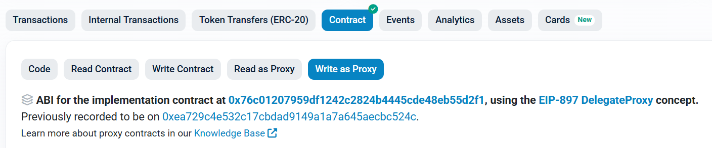

# Unstake, Restake, and Withdraw Functions

---

## Table of Contents
- [Overall Unstaking/Withdrawal Flow](#overall-unstakingwithdrawal-flow)
- [requestWithdrawal](#requestwithdrawaladdress-layer2-uint256-amount)
- [redepositMulti](#redepositmultiaddress-layer2-uint256-n)
- [processRequests](#processrequestsaddress-layer2-uint256-index)

---

## Overall Unstaking/Withdrawal Flow

1. **Withdrawal Request (Unstaking)**
   - To unstake and request withdrawal, use the `requestWithdrawal` function.
   - For details, see the [requestWithdrawal](#requestwithdrawaladdress-layer2-uint256-amount) section.

2. **Restaking**
   - To restake pending withdrawal amounts, use the `redepositMulti` function.
   - For details, see the [redepositMulti](#redepositmultiaddress-layer2-uint256-n) section.

3. **Withdrawal**
   - When withdrawal becomes available, use the `processRequests` function to actually withdraw TON.
   - For details, see the [processRequests](#processrequestsaddress-layer2-uint256-index) section.

4. **Detailed Information**
   - For operator and L2 information, see [check l2 information.md].

> For each step, refer to the table of contents and explanations in the relevant document for function usage, parameters, and examples.

---

> You can execute staking-related functions through the DepositManager contract.
- DepositManager: [etherscan link](https://etherscan.io/address/0x0b58ca72b12f01fc05f8f252e226f3e2089bd00e#writeProxyContract)

You can check the available functions on the **Write as Proxy** page of the Etherscan link above.

*********

### [requestWithdrawal(address layer2, uint256 amount)](https://etherscan.io/address/0x0b58ca72b12f01fc05f8f252e226f3e2089bd00e#writeProxyContract#F15)

Request withdrawal of staked amount.

TON requested for withdrawal via requestWithdrawal is managed by the number of requests, not by the TON amount. For example, whether you unstake 100 TON or 1000 TON, each is managed as one withdrawal request.

- Parameters
  - address layer2: Operator address to withdraw from
  - uint256 amount: Amount to withdraw (Ray, 27 decimal)
- Result
  - None

*********

### [redepositMulti(address layer2, uint256 n)](https://etherscan.io/address/0x0b58ca72b12f01fc05f8f252e226f3e2089bd00e#writeProxyContract#F11)

Restake pending withdrawal requests. See below for details on the value of n.

- Parameters
  - address layer2: Operator address to restake to
  - uint256 n: Number of requests to restake
- Result
  - None

*********

### [processRequests(address layer2, uint256 n)](https://etherscan.io/address/0x0b58ca72b12f01fc05f8f252e226f3e2089bd00e#writeProxyContract#F9)

Withdraws requests that have passed the pending period.

- Parameters
  - address layer2: Operator address to withdraw TON from
  - uint256 n: Number of requests to withdraw
  - bool receiveTON: Whether to receive as TON (true) or WTON (false)
- Result
  - None

*********

# Request-Related Read Functions
> You can check staking-related information through the DepositManager contract.  
> DepositManager: [etherscan link](https://etherscan.io/address/0x0b58ca72b12f01fc05f8f252e226f3e2089bd00e#readProxyContract)

The following functions can be executed directly on the **Read as Proxy** tab in Etherscan.

*********

### [numPendingRequests(address layer2, address account)](https://etherscan.io/address/0x0b58ca72b12f01fc05f8f252e226f3e2089bd00e#readProxyContract#F16)

Returns the number of pending withdrawal requests for a specific account and layer2 operator.

- Parameters
  - address layer2: Layer2 operator address
  - address account: User address to check
- Return value
  - uint256: Number of pending withdrawal requests

*********

### [numRequests(address layer2, address account)](https://etherscan.io/address/0x0b58ca72b12f01fc05f8f252e226f3e2089bd00e#readProxyContract#F17)

Returns the total number of withdrawal requests created by a specific account for a specific layer2 operator.

- Parameters
  - address layer2: Layer2 operator address
  - address account: User address to check
- Return value
  - uint256: Total number of withdrawal requests

*********

### [withdrawalRequest(address layer2, address account, uint256 index)](https://etherscan.io/address/0x0b58ca72b12f01fc05f8f252e226f3e2089bd00e#readProxyContract#F16)

Returns detailed information about a withdrawal request created by a specific account for a specific layer2 operator.

- Parameters
  - address layer2: Layer2 operator address
  - address account: User address to check
  - uint256 index: Request index (starting from 0)
- Return value
  - withdrawableBlockNumber: Block number when withdrawal is available (e.g., 22579548)
  - amount: Amount requested for withdrawal at this index (Ray, e.g., 10000000000000000000000000000)
  - processed: Whether the request has been withdrawn or restaked (e.g., true)

*********

> To restake or unstake, you only need to check the currently pending requests. Therefore, after checking the total number of requests with numRequests(), use withdrawalRequest to check the status of your requests (e.g., if numRequests returns 4, check withdrawalRequest with index 3, 2, 1, etc.).

> Among the requests, those with withdrawableBlockNumber less than the current block number and processed as false are eligible for withdrawal. If there is one such request, set n=1 in processRequests; if there are two, set n=2, and so on. If there are two eligible requests and you set n=1, the earliest request will be withdrawn (you cannot specify a particular index). 