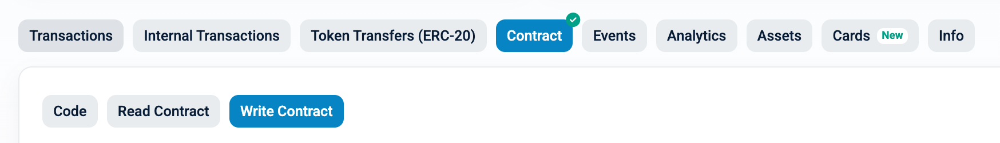

# TON 스테이킹 함수
> TON 컨트랙을 통해 스테이킹과 관련된 함수를 실행 할 수 있습니다.
- TON : [etherscan link](https://etherscan.io/address/0x2be5e8c109e2197D077D13A82dAead6a9b3433C5#writeContract)

위의 이더스캔 링크 페이지의 **Write** 페이지에서 실행 가능한 함수를 확인하실 수 있습니다.

*********

### [approveAndCall(address spender, uint256 amount, data bytes)](https://etherscan.io/address/0x2be5e8c109e2197D077D13A82dAead6a9b3433C5#writeContract#F3)

TON 토큰을 스테이킹 컨트랙트에 승인(approve)하고, 동시에 지정된 layer2 오퍼레이터에 스테이킹을 실행하는 함수입니다.

- 파라미터
  - address spender: WTON 주소(`0xc4A11aaf6ea915Ed7Ac194161d2fC9384F15bff2`)
  - uint256 amount: 스테이킹할 TON 토큰 수량(Wei)
  - data: DepositManager 주소(고정)와 스테이킹할 오퍼레이터 주소(가변)를 인코딩한 값
- 결과값
  - 없음

> 이 함수는 approve와 staking을 한 번에 처리하므로, 별도의 approve 트랜잭션 없이 바로 스테이킹이 가능합니다.

**data 파라미터 설명**
- data 필드는 DepositManager 주소(예: `0x0b58ca72b12f01fc05f8f252e226f3e2089bd00e`)와 스테이킹할 오퍼레이터 주소(예: `0xF078AE62eA4740E19ddf6c0c5e17Ecdb820BbEe1`)를 순서대로 32바이트씩 이어붙여 인코딩한 값입니다.
- DepositManager 주소는 항상 고정되어 있으며, 오퍼레이터 주소만 변경됩니다.
- 예시:
  - data = `0x0000000000000000000000000b58ca72b12f01fc05f8f252e226f3e2089bd00e000000000000000000000000F078AE62eA4740E19ddf6c0c5e17Ecdb820BbEe1`
    - 앞 32바이트: DepositManager 주소
    - 뒤 32바이트: 스테이킹할 오퍼레이터 주소

> 오퍼레이터 주소만 변경하여 여러 오퍼레이터에 대해 스테이킹을 진행할 수 있습니다.

*********

# WTON 스테이킹 함수
> WTON 컨트랙을 통해 스테이킹과 관련된 함수를 실행 할 수 있습니다.
- WTON : [etherscan link](https://etherscan.io/address/0xc4A11aaf6ea915Ed7Ac194161d2fC9384F15bff2#writeContract)

위의 이더스캔 링크 페이지의 **Write** 페이지에서 실행 가능한 함수를 확인하실 수 있습니다.

*********

### [approveAndCall(address spender, uint256 amount, data bytes)](https://etherscan.io/address/0xc4A11aaf6ea915Ed7Ac194161d2fC9384F15bff2#writeContract#F3)

WTON 토큰을 스테이킹 컨트랙트에 승인(approve)하고, 동시에 지정된 layer2 오퍼레이터에 스테이킹을 실행하는 함수입니다.

- 파라미터
  - address spender: DepositManager 주소(`0x0b58ca72b12f01fc05f8f252e226f3e2089bd00e`)
  - uint256 amount: 스테이킹할 TON 토큰 수량(Ray)
  - data: 스테이킹할 오퍼레이터 주소(가변)를 인코딩한 값
- 결과값
  - 없음

> 이 함수는 approve와 staking을 한 번에 처리하므로, 별도의 approve 트랜잭션 없이 바로 스테이킹이 가능합니다.

**data 파라미터 설명**
- data 필드는 스테이킹할 오퍼레이터 주소(예: `0xF078AE62eA4740E19ddf6c0c5e17Ecdb820BbEe1`)를 순서대로 32바이트씩 이어붙여 인코딩한 값입니다.
- 스테이킹을 하고자 하는 오퍼레이터의 주소만 변경하면 됩니다.
- 예시:
  - data = `0x000000000000000000000000F078AE62eA4740E19ddf6c0c5e17Ecdb820BbEe1`
    - 뒤 32바이트: 스테이킹할 오퍼레이터 주소

> 오퍼레이터 주소만 변경하여 여러 오퍼레이터에 대해 스테이킹을 진행할 수 있습니다.
