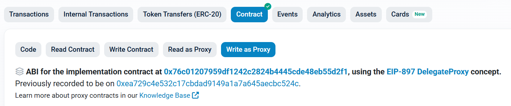

# TON 스테이킹 관련 함수
> DepositManager 컨트랙을 통해 스테이킹과 관련된 함수를 실행 할 수 있습니다.
- StakingV2Proxy : [etherscan link](https://etherscan.io/address/0x14fb0933ec45ece75a431d10afaa1ddf7bfee44c#writeProxyContract)

위의 이더스캔 링크 페이지의 **Write as Proxy** 페이지에서 실행 가능한 함수를 확인하실 수 있습니다.

*********

### [requestWithdrawal(address layer2, uint256 amount)](https://etherscan.io/address/0x0b58ca72b12f01fc05f8f252e226f3e2089bd00e#writeProxyContract#F15)

스테이킹 된 수량 출금 요청하기

- 파라미터
  - address layer2: 출금을 수행할 오퍼레이터 주소
  - uint256 amount: 출금할 수량
- 결과값
  -  없음

*********

### [redepositMulti(address layer2, uint256 n)](https://etherscan.io/address/0x0b58ca72b12f01fc05f8f252e226f3e2089bd00e#writeProxyContract#F11)

출금 요청 대기 중인 수량들 다시 스테이킹하기

- 파라미터
  - address layer2: 출금을 수행할 오퍼레이터 주소
  - uint256 n: 다시 스테이킹 요청할 요청의 개수
- 결과값
  -  없음

*********