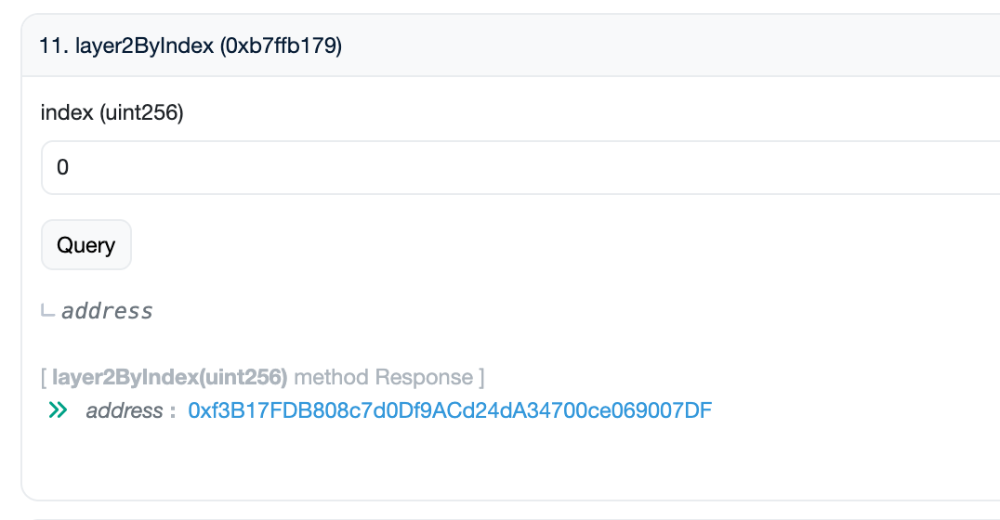
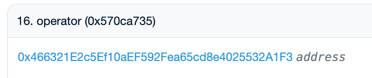
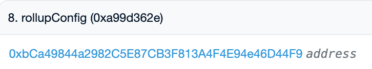

# 오퍼레이터 정보 확인 함수
> 오퍼레이터의 주요 정보를 확인할 수 있는 함수 및 절차를 안내합니다.
Layer2Registry: [etherscan link](https://etherscan.io/address/0x7846c2248a7b4de77e9c2bae7fbb93bfc286837b)

*********

### [numLayer2s()](https://etherscan.io/address/0x7846c2248a7b4de77e9c2bae7fbb93bfc286837b#readProxyContract#F13)

등록된 전체 Layer2 오퍼레이터(네트워크) 개수 조회

- 결과
  - uint256: 등록된 Layer2 오퍼레이터(네트워크) 개수

*********

### [layer2ByIndex(uint256 index)](https://etherscan.io/address/0x7846c2248a7b4de77e9c2bae7fbb93bfc286837b#readProxyContract#F11)

인덱스를 통해 등록된 오퍼레이터(네트워크) 주소 조회

- 파라미터
  - uint256 index: 조회할 인덱스 (0부터 시작)
- 결과
  - address: 해당 인덱스의 candidateContract 주소

*********

해당 address를 클릭하면 Candidate Contract로 이동, 그 후에 memo()를 통해 원하는 오퍼레이터가 맞는지 확인할 수 있음

### memo()(https://etherscan.io/address/[candidateContract]#readProxyContract#F16)

오퍼레이터의 이름 또는 메모 정보 조회

- 결과
  - string: 오퍼레이터 이름 또는 메모

*********

### stakedOf(address user)(https://etherscan.io/address/[candidateContract]#readProxyContract#F22)

특정 사용자가 오퍼레이터에 스테이킹한 수량 조회

- 파라미터
  - address user: 조회할 사용자 주소
- 결과
  - uint256: 사용자의 스테이킹 수량

*********

### totalStaked() (https://etherscan.io/address/[candidateContract]#readProxyContract#F24)

오퍼레이터에 스테이킹된 전체 수량 조회

- 결과
  - uint256: 해당 오퍼레이터에 스테이킹된 전체 수량

*********

### [operator()] (https://etherscan.io/address/[candidateContract]#readProxyContract#F16)

오퍼레이터 컨트랙트 주소 조회

- 결과
  - address: 오퍼레이터 매니저 컨트랙트 주소(operatorManager)

### rollupConfig() (https://etherscan.io/address/[operatorManager]#readProxyContract#F8)

오퍼레이터의 롤업 설정(RollupConfig) 컨트랙트 주소 조회

*********

- 파라미터
  - 없음
- 결과
  - address: RollupConfig 컨트랙트 주소

*********

## Layer2 Manager Contract
Layer2Manager: [etherscan link](https://etherscan.io/address/0xD6Bf6B2b7553c8064Ba763AD6989829060FdFC1D)

### [checkL1BridgeDetail(address rollupConfigAddress)](https://etherscan.io/address/0xD6Bf6B2b7553c8064Ba763AD6989829060FdFC1D#readProxyContract#F5)

L1 브릿지 상세 정보 조회

- 파라미터
  - address rollupConfigAddress: RollupConfig 컨트랙트 주소
- 결과
  - array: L1 브릿지 상세 정보 (5번째 인덱스가 1이면 L2 오퍼레이터). L2 오퍼레이터가 아니면 아래의 내용은 조회가 불가능

*********

### optimismPortal() (https://etherscan.io/address/[rollupConfigAddress]#readProxyContract#F29)

L2 브릿지(Optimism Portal) 주소 조회

- 결과
  - address: L2 브릿지 주소

*********

## L2 시퀀서 시뇨리지 관련 정보 확인

### operator [balanceOf(address account)](https://etherscan.io/address/0xc4A11aaf6ea915Ed7Ac194161d2fC9384F15bff2#readContract#F2)

Operator Manager 컨트랙트가 소유하고 있는 WTON의 밸런스 확인

- 파라미터
  - address account: operatorManager 주소
- 결과
  - uint256: operatorManager의 잔액

*********

### [estimatedDistribute(uint256 blockNumber, address opAddress)](https://etherscan.io/address/0x0b55a0f463b6defb81c6063973763951712d0e5f#readProxyContract#F30)

다음 블록에서 분배될 예상 시그(Seig) 보상량 조회

- 파라미터
  - uint256 blockNumber: 햔제 블록 번호 + 1
  - address opAddress: [candidateContract](#layer2byindexuint256-index) 입력
- 결과
  - array: 분배 예상 정보 (7번째 인덱스가 추가로 분배될 WTON)

Operator Manager가 갖고있는 WTON의 밸런스와 estimateDistribution으로 확인 된 값의 합이 현재 L2 시퀀서가 받을 수 있는 시뇨리지

*********
