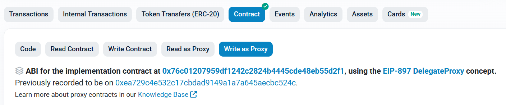

# Unstake, Restake, Withdraw 함수
> DepositManager 컨트랙을 통해 스테이킹과 관련된 함수를 실행 할 수 있습니다.
- DepositManager : [etherscan link](https://etherscan.io/address/0x0b58ca72b12f01fc05f8f252e226f3e2089bd00e#writeProxyContract)

위의 이더스캔 링크 페이지의 **Write as Proxy** 페이지에서 실행 가능한 함수를 확인하실 수 있습니다.

*********

### [requestWithdrawal(address layer2, uint256 amount)](https://etherscan.io/address/0x0b58ca72b12f01fc05f8f252e226f3e2089bd00e#writeProxyContract#F15)

스테이킹 된 수량 출금 요청합니다.

requestWithdrawal을 통해 춞금 요청된 TON 은 TON 단위로 관리되는 것이 아닌 요청의 개수 단위로 관리가 됩니다. 
즉, 100TON을 Unstaking해도 1000 TON을 Unstaking 해도 각각 1개의 출금 요청(request)로 관리됩니다.

- 파라미터
  - address layer2: 출금을 수행할 오퍼레이터 주소
  - uint256 amount: 출금할 수량
- 결과
  -  없음

*********

### [redepositMulti(address layer2, uint256 n)](https://etherscan.io/address/0x0b58ca72b12f01fc05f8f252e226f3e2089bd00e#writeProxyContract#F11)

출금 요청 대기 중인 수량들 다시 스테이킹 합니다. n과 관련된 값들은 아래

- 파라미터
  - address layer2: 다시 스테이킹을 수행할 오퍼레이터 주소
  - uint256 n: 다시 스테이킹 할 요청의 개수
- 결과
  -  없음

*********

### [processRequests(address layer2, uint256 n)](https://etherscan.io/address/0x0b58ca72b12f01fc05f8f252e226f3e2089bd00e#writeProxyContract#F9)

출금 요청 대기 기간이 지난 Request들에 대해 인출을 합니다.

- 파라미터
  - address layer2: TON을 인출할 오퍼레이터 주소
  - uint256 n: 인출 할 요청의 개수
  - bool receiveTON: TON으로 받을지 WTON으로 받을지 여부(TON: true, WTON:false)
- 결과
  -  없음

*********

# Request 관련 읽기 함수
> DepositManager 컨트랙트를 통해 스테이킹과 관련된 정보를 조회할 수 있습니다.  
> DepositManager : [etherscan link](https://etherscan.io/address/0x0b58ca72b12f01fc05f8f252e226f3e2089bd00e#readProxyContract)

아래 함수들은 이더스캔의 **Read as Proxy** 탭에서 직접 실행해볼 수 있습니다.

*********

### [numPendingRequests(address layer2, address account)](https://etherscan.io/address/0x0b58ca72b12f01fc05f8f252e226f3e2089bd00e#readProxyContract#F16)

특정 계정이 특정 layer2 오퍼레이터에 대해 대기 중인 출금 요청의 개수를 반환합니다.

- 파라미터
  - address layer2: layer2 오퍼레이터 주소
  - address account: 조회할 사용자 주소
- 반환값
  - uint256: 대기 중인 출금 요청 개수

*********

### [numRequests(address layer2, address account)](https://etherscan.io/address/0x0b58ca72b12f01fc05f8f252e226f3e2089bd00e#readProxyContract#F17)

특정 계정이 특정 layer2 오퍼레이터에 대해 생성한 전체 출금 요청의 개수를 반환합니다.

- 파라미터
  - address layer2: layer2 오퍼레이터 주소
  - address account: 조회할 사용자 주소
- 반환값
  - uint256: 전체 출금 요청 개수

*********

### [withdrawalRequest(address layer2, address account, uint256 index)](https://etherscan.io/address/0x0b58ca72b12f01fc05f8f252e226f3e2089bd00e#readProxyContract#F16)

특정 계정이 특정 layer2 오퍼레이터에 대해 생성한 출금 요청의 상세 정보를 반환합니다.

- 파라미터
  - address layer2: layer2 오퍼레이터 주소
  - address account: 조회할 사용자 주소
  - uint256 index: 요청 인덱스 (0부터 시작)
- 반환값
  - withdrawableBlockNumber: 출금 가능한 블록 번호(ex. 22579548)
  - amount: 해당 Index의 request에 요청했던 출금 수량(Ray 단위 ex. 10000000000000000000000000000)
  - processed: 인출이 되거나 다시 스테이킹이 되었는지 여부(ex. true) 

*********

> Restake나 Unstake를 하려면 현재 대기중인 Request만 확인하면 됩니다. 그러므로 numRequests()를 통해서 Request의 총 개수를 확인한 후 withdrawalRequest를 통해서 현재 내 Request의 상태를 확인하면 됩니다.(ex. numRequests의 값이 4일 경우 withdrawalRequest의 index를 3, 2, 1 이런 순서대로 확인)

> Request들 중에서 withdrawableBlockNumber가 현재 블록 번호보다 작으면서, processed가 false인 경우 인출 가능한 Request가 됩니다. 이러한 Request개수가 1개면 processRequest에 n 값을 1, 2개면 2를 넣으면 됩니다. 인출 가능한 Request 개수가 2개 일때, n 값에 1을 넣고 processRequest를 수행하면 앞선 인덱스의 요청이 출금됩니다. (특정 인덱스 지정 불가)